### VBA forum
#### Forum for VBA programmers with social media app features
---
*Attention! For non-authenticated users this application provides only existing content review, such as questions and their answers. More features are available only for registered and authenticated users.*

## Features
# **UserProfile custom model**
Thanks django built-in User class, creating new user object is quite easy, but application 'account' extends basic user model by adding new fields in UserProfile custom model, such as:
<ul>
    <li>avatar - profile picture, (every time once new user instance is creating, the default picture is set up for this field)</li>
    <li>role - closed list of roles that user is able to choose for account</li>
    <li>bio - additional information about user, not required field</li>
    <li>stop_notification - a boolean field that indicates if user wants to get email notification if someone adds answers to question that given user posted</li>
    <li>following - a many to many relation field that creates new relations table in database for storing scope of followers and following users</li>
</ul>
Additionally, UserProfile signals (to create UserProfile instance for admin's account, which is not registering with form as regular, non-staff user), dunder method <code>__str__</code> for describe instances in admin panel correctly and custom instance method <code>display_fullname_user_role</code> to make easier to display full name role of each instance.

```
class UserProfile(models.Model):

    user = models.OneToOneField(
        User,
        on_delete=models.CASCADE,
        primary_key = True)
    
    bio = models.TextField(max_length=500, blank=True)
    
    roles = [
        ("DEV", "developer"),
        ("STU", "student"),
        ("INT", "internship"),
        ("MAN", "project manager"),
        ("EMP", "employer"),
        ("TEC", "teacher"),
        ("OTH", "other"),
        ("ADM", "admin"),
    ]

    role = models.CharField(
        max_length=3,
        choices=roles,
        default="ADM"
    )

    avatar = models.ImageField(upload_to="images/", default="images/default_user_img_nnlwnz.jpg")

    stop_notifications = models.BooleanField(default=False,
                                             help_text= "if user wants to turn off email notification when question has been answered")
    
    following = models.ManyToManyField(User, blank=True, related_name="following")

    @receiver(post_save, sender=User)
    def create_user_profile(sender, instance, created, **kwargs):
        if created:
            UserProfile.objects.create(user=instance)

    @receiver(post_save, sender=User)
    def save_user_profile(sender, instance, **kwargs):
        instance.userprofile.save()

    def __str__(self):
        return f"{self.user}"
    
    def display_fullname_user_role(self):
        for short, long in self.roles:
            if self.role == short:
                return long
```
# **Registration and authentication system**
In order to register, new user needs fo fill out below form with correct data:
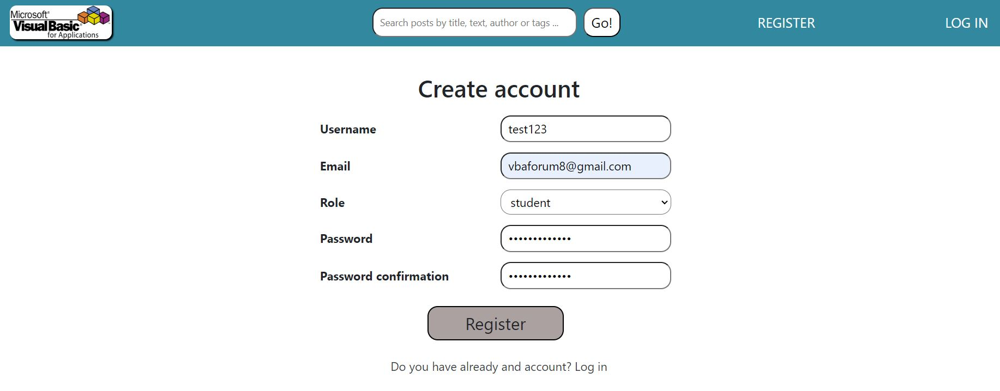
In case of successully registration, it creates new **inactive** instance of user and UserProfile accordingly. To **activate** your account and make possible to use the Forum, you will get a request to go to your mailbox, you provided on registration, and just click in proper button on message body.
The path looks as follows:

1. Account created message
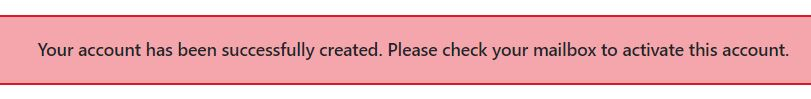

2. Verification mail
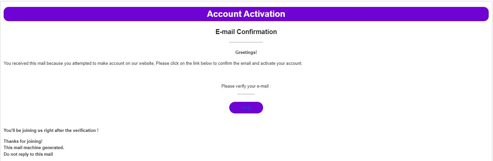

3. Verification success and redictering to log in page
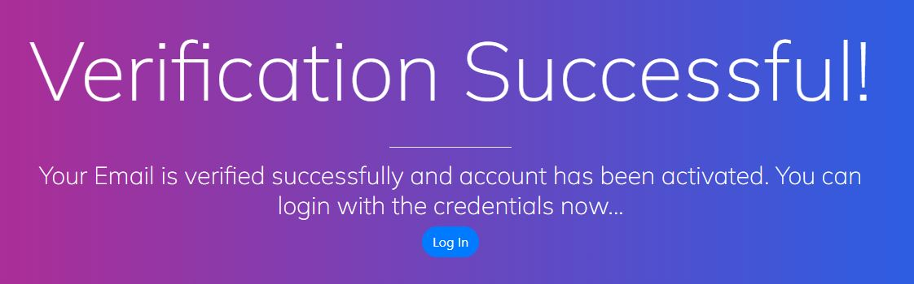

However, if you provide username that already exists in database, email you provided is already taken by another user, or your password doesn't satisfy requirements, proper message will be displayed.

1. Email taken case message<br>
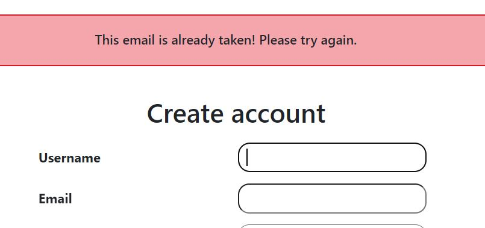

2. Usename taken case message<br>
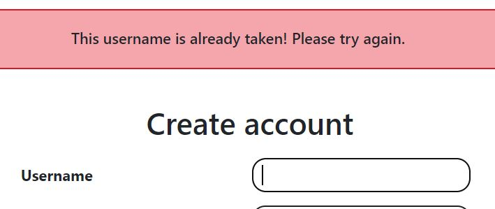

3. Password error message - the message content depends on how many requirements you didn't satisfy.<br>
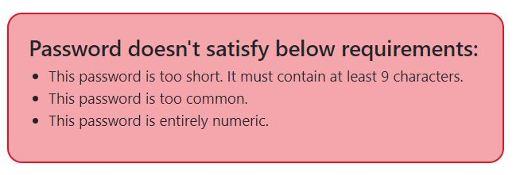

# **User profile view, modification, deleting account, password changing and reseting**
Once your are not anonymous user anymore (after log in), it is possible to glimpse your profile. By default, it looks following:

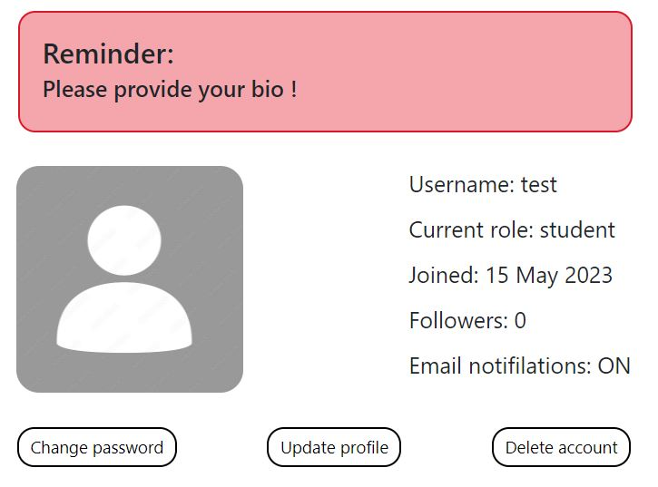
<ol>
    <li>Basic user information from both User and UserProfile tables in database</li>
    <li>Default profile picture</li>
    <li>Reminder from backend will be visible untile you provide your bio</li>
    <li>Three options of account management</li>
        <ul>
            <li>Change password</li>
            <li>Update profile properties</li>
            <li>Delete account</li>
        </ul>
</ol>

### **Changing password**
You can easily change password just by submitting below form:<br>
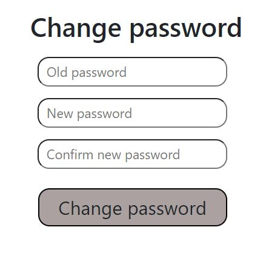<br>
If data you provided is correct, an prover message will be returned:<br>
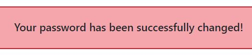<br>
In case you put wrong old password or new one doesn't satisfy requirements, user will be informed about that fact.

### **Profile updating**
User is able to change for their account following properties:
<ul>
    <li>Username</li>
    <li>email address</li>
    <li>role</li>
    <li>profile picture</li>
    <li>provide bio</li>
    <li>stop notification (if stop notification is <code>True</code>, user will not receive notifications if someone answers his question on the forum)</li>
</ul>

After modification, user profile page shows up to date informations. For this example, I updated:
<ul>
    <li>role - from student to developer</li>
    <li>profile picture - from default to custom</li>
    <li>bio</li>
    <li>turned off email notifications</li>
</ul>

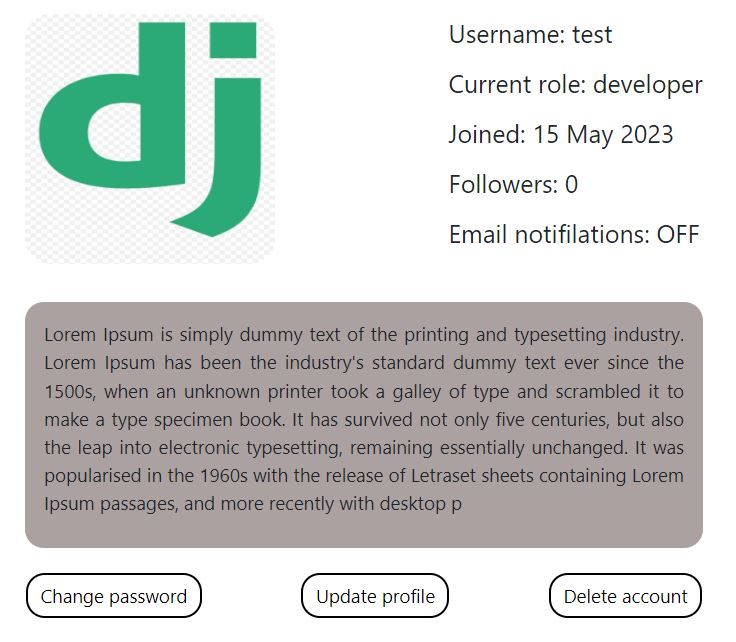<br>

### **Account deleting**
Logging out user and permanently delete their profile with all related content included.

# **CRUD**
All of authenticated users are allowed to both create, read, update and delete content, which means they can post new questions and comment them, edit body of content they created or just remove them.

### **Create and read**
User can post new question just by filling out proper form on **NEW QUEST nabvar tab**<br>
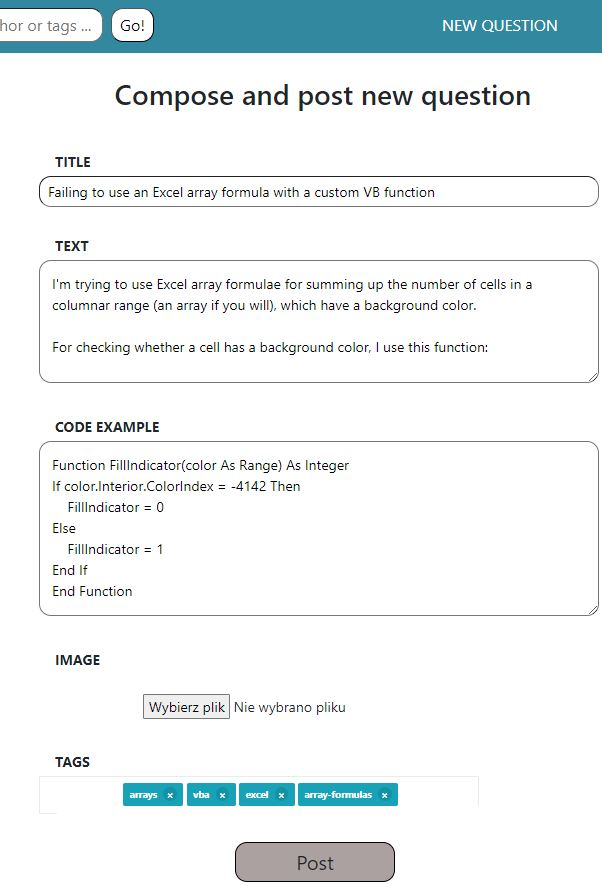<br>
Each question instance is composed of:
<ul>
    <li>Subject</li>
    <li>Text, problem description in details</li>
    <li>Code example and image - not required fields</li>
    <li>Tags</li>
</ul>

Once question is already posted, it will be visible on the wall with informations: who and when submitted that question, title and beginning of the text body, tags and how many thumbs and comments particular question has.
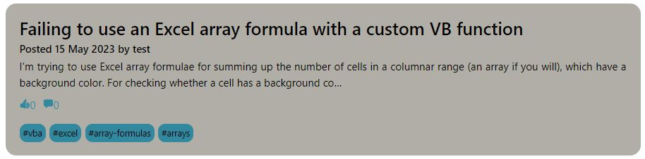<br>

To go to question details, just click on them directly, then you will be redirected to html template with all that question details and comments, if they are.
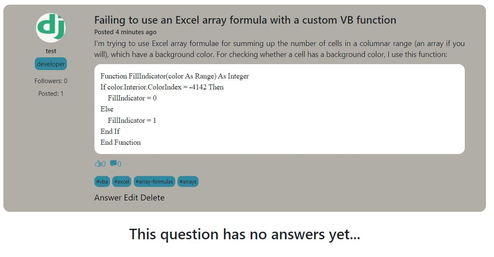<br>
Basically, if user is author of specific question, on the bottom there are 3 options (answer, edit and delete), but if you are not author, you can only answer them.
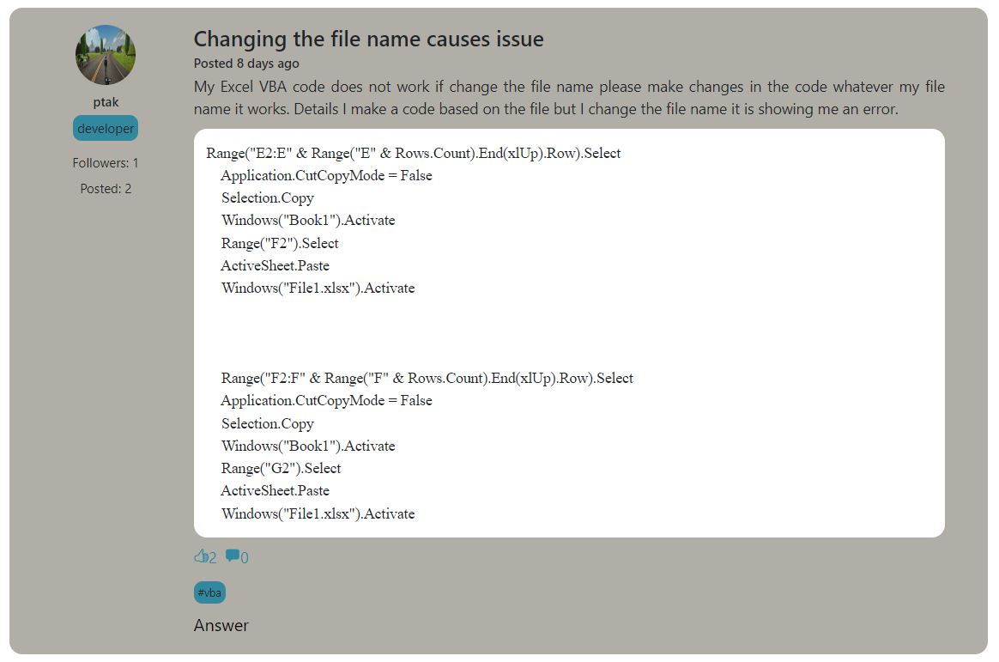<br>

### **Update**
I updated previously added question just by adding picture:
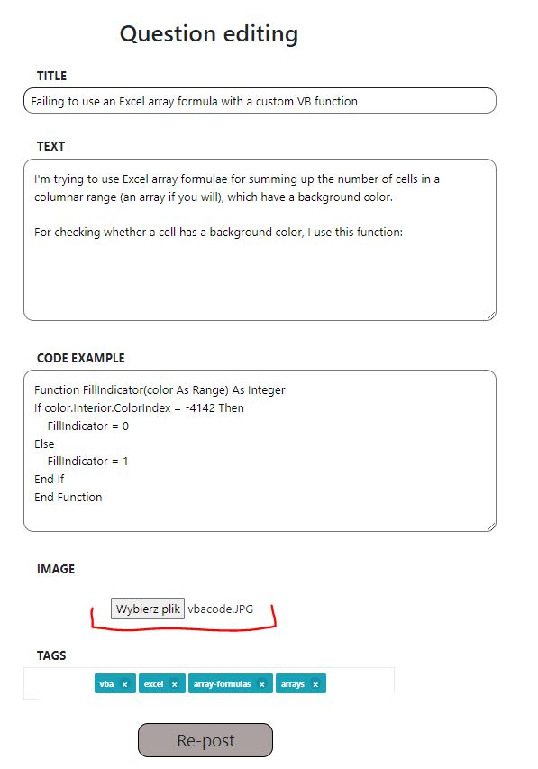<br>

Once action is done, proper message will be displayed:
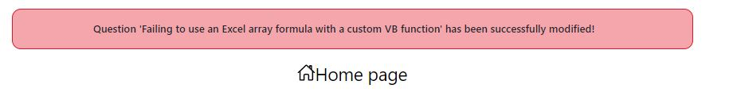<br>

Currently, updated question has image attached this time (fullsize picture is possible to preview by clicking direcntly on that):
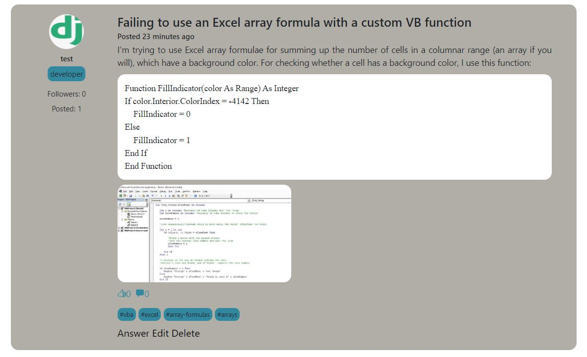<br>
On wall:
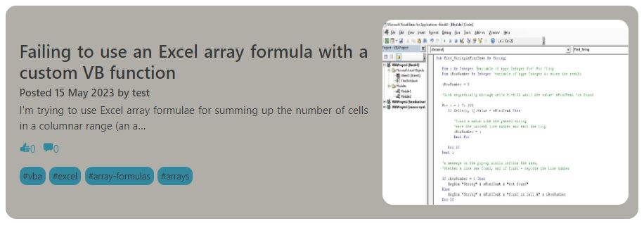<br>

### **Delete**
Only question author is allowed to remove them just by clicking 'Delete' button.
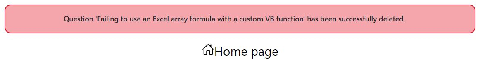<br>

# **Adding comments (answers)**
Every answer is related with specific question thanks question foreign key field in Answer model

```
question = models.ForeignKey(Question, on_delete=models.CASCADE, related_name="answers")
```
Adding answer with displaying question you answering to.
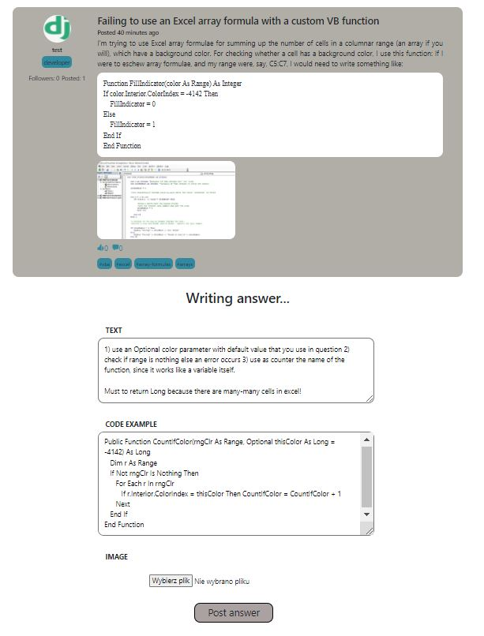<br>

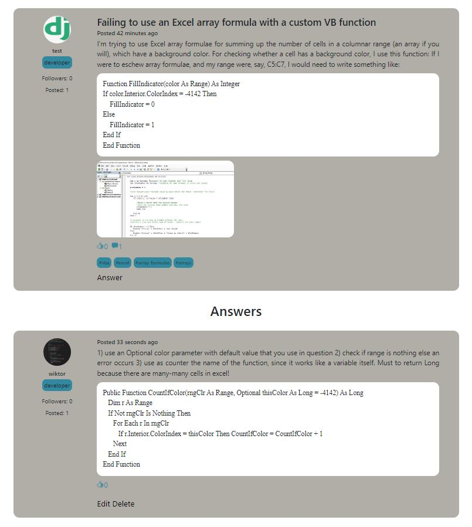<br>

*Note that CRUD concerns both question and answers content!*

# **Likes and quick access**
Each of authenticated user is able to like both questions and answers, at the same time saving them to quick access collection. Both classes <code>Question</code> and <code>Answer</code> have many to many related filed calls <code>likes</code>. It allows to add simple relationship which is represented in database as 2 columns tables (1st - liked question/answer id, 2nd - user id who like that question/answer).

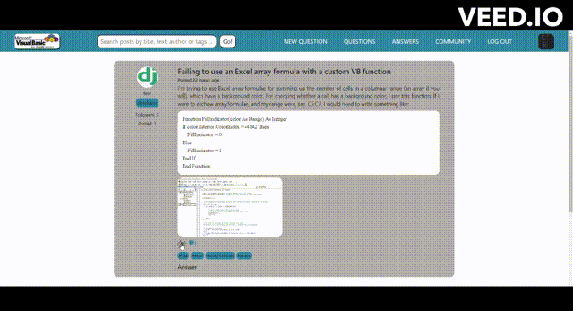<br>

Quick access tabs are the 2nd and 3rd on the main navbar calls respectively 'Questions' and 'Answer'. Both included content you posted or liked.
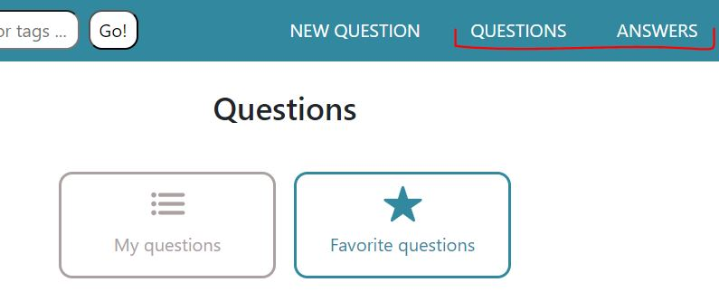<br>
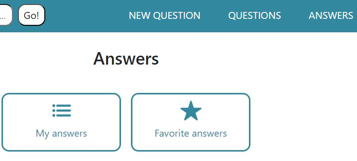<br>

Here will be displayed all question/answers that you posted with basic information and management options
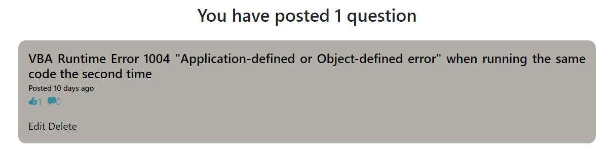<br>

Here will be displayed all question/answers that you like with basic information and management options
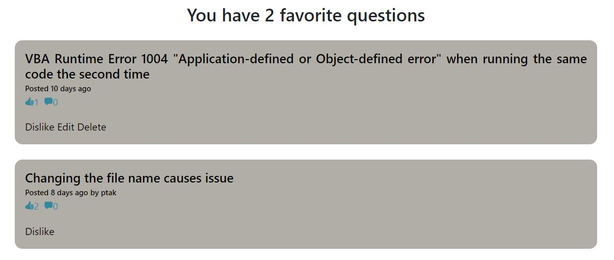<br>

# **Searchbar**
Thanks filtering database content, user is allowed to browse posted questions by:
<ul>
    <li>title</li>
    <li>text</li>
    <li>author's username</li>
    <li>tags</li>
</ul>

Techncally, it is possible thanks advanced queryset filtering:
```
queryset = Question.objects.filter(
    Q(title__icontains = word) | 
    Q(text__icontains = word) | 
    Q(user__username__icontains = word) | 
    Q(tags__name__icontains = word)
```
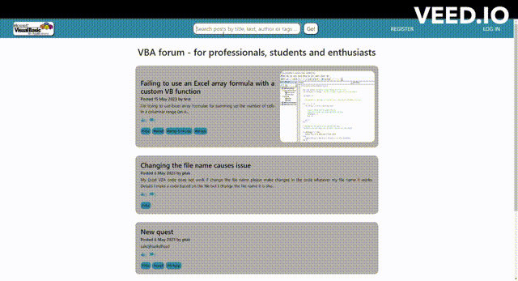<br>

# **Community**
Community tab includes 4 main components:
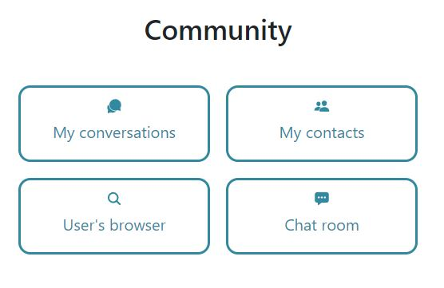<br>

### **Users brower**
It allows you to find any user with active and non-staff account. Additionally, it counts how many users currently satisfy that requirments. Moreover, searchbar helps to find specific users by filtering using username or role.
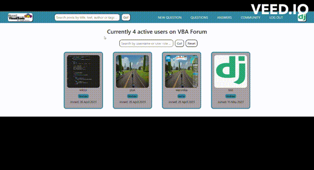<br>

### **My contacts**
A scope of users that you follow.
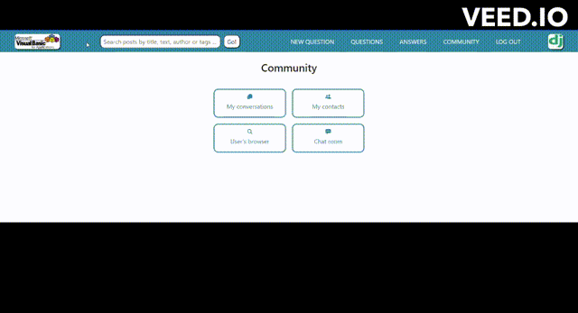<br>

### **My conversations**
The backend allows users to send messages from application level. Initially, *My conversations* is empty, to send message to specific user, it's necessary to open their profile view page.
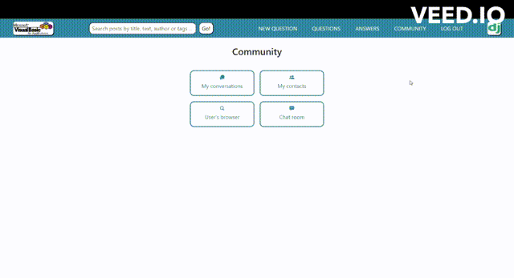<br>

Messages are displaying by proper sides, it depends who are receiver and sender.
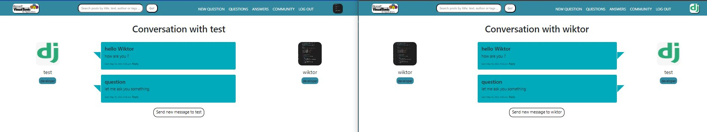<br>


